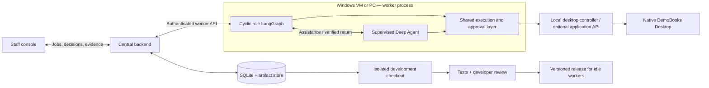

<div align="center">

# Enterprise Agent System

**A digital worker that follows tested procedures, asks for help, and learns through reviewed code.**

Python · LangGraph · Deep Agents · OpenRouter · Windows UI Automation · FastAPI

[Quick start](#quick-start) · [Try the demonstration](#try-the-demonstration) · [How it works](#how-it-works) · [Teach a reusable improvement](#teach-a-reusable-improvement) · [Validation](#validation)

</div>

---

Enterprise Agent System is a department-agnostic platform for supervised digital workers. Departments supply role-specific workflows, tools, permissions, and knowledge scopes; the platform provides job dispatch, approvals, evidence, recovery, and developer-reviewed improvements.

**This is an experimental prototype.** I'm sharing it to get my ideas out there and explore how supervised digital workers could work. I know it isn't ready for me to dogfood in day-to-day work or for a business to adopt. The demonstrations, tests, and documented limitations reflect an idea in development, not a finished product.

I started this because I haven't found a good option for enterprise computer-use agents that brings together reliability, security, and a feedback cycle that learns from humans. I want to explore how tested procedures, supervised assistance, and human corrections could lead to improvements that developers review before they reach future runs. Those are the goals behind this prototype, not qualities I'm claiming it has already achieved.

The first runnable example is a Finance workflow: a worker opens a synthetic invoice, compares it with a purchase order, identifies a discrepancy, and saves and verifies a correction draft. Staff can approve each operation, supervise unfamiliar situations, correct proposed actions, or take over the desktop.

An accepted episode can become a small, tested code proposal. A developer reviews the exact candidate before it can be released to idle workers. Future jobs pin the improved procedure version.

Requests with no matching procedure enter supervised assistance automatically. Unfamiliar application states and failures in implemented procedures are separate fallback reasons. Staff review the proposed actions and the outcome in the same job. See [automatic workflow discovery](docs/workflow-discovery.md) for the implemented behavior and the limits of general workflow generation.

**Desktop setup: the developer machine runs the backend and staff frontend; a separate Windows VM or PC runs LangGraph, the Deep Agent harness, desktop control, and DemoBooks.** The optional single-machine browser fixture uses a simulated model for regression tests. DemoBooks is a prototype application with synthetic records, not a QuickBooks integration.


## Developer setup

The shared platform is department-agnostic; the first runnable workflow belongs to **Finance**. [Department workflow extensions](docs/departments.md) explain how other departments bring their own input schemas, graphs, adapters, and permissions.

The split has been exercised with a complete Windows job and live model assistance ([execution evidence](docs/evidence/windows-edge-worker.json)). Follow the [two-machine developer setup](docs/developer-setup.md): start `enterprise serve` on the developer machine and `enterprise worker` on Windows. Addresses and credentials are configured locally. The backend does not connect directly to the desktop controller.

The native application can run with its API disabled. A separate controller reads accessibility controls and supplies accessibility actions or real clicks/typing. See [legacy desktop setup](docs/legacy-desktop.md) and the optional [application API adapter](docs/windows-accounting-machine.md).


## Quick start

This is the **optional browser test fixture**, useful without a Windows machine or model key. For the desktop prototype, use the [two-machine setup](docs/developer-setup.md).

Requires Python 3.11+ (tested on 3.12), Git, and a Chromium-compatible development machine. Linux is the tested platform.

```bash
git clone git@github.com:philip-roy-jones/enterprise-agent-system.git
cd enterprise-agent-system

python3 -m venv .venv
source .venv/bin/activate
pip install -r requirements.lock
pip install -e . --no-deps
python -m playwright install chromium
cp .env.example .env

enterprise dev
```

On a minimal Linux machine, install browser system dependencies with `python -m playwright install --with-deps chromium`.

Open **[localhost:8000](http://127.0.0.1:8000)**. The default local staff token is prefilled in the connection dialog. Create a job and approve its first operation.

`enterprise dev` starts the backend and worker as separate processes. Ctrl+C stops both. To run them independently:

```bash
# Terminal 1
enterprise serve

# Terminal 2
enterprise worker
```

The browser test workspace is at **[localhost:8000/mock](http://127.0.0.1:8000/mock)** in browser mode only. Windows deployments disable it. Use **Take control** before interacting with an active worker's desktop. Use **Release control** to resume automation.

Staff can also add scoped organizational guidance for the worker to search with individual approval. See [knowledge setup and access boundaries](docs/organizational-knowledge.md).

## Try the demonstration

The **New job** dialog selects an invoice, approval mode, and optional interruption. New jobs default to Strict.

| Try this | What you should see |
| --- | --- |
| Normal workspace + **Strict** | Approval before validation, opening the invoice, comparison, draft preparation, save, verification, and completion |
| Normal workspace + **Auto** | The same verified result without node approval prompts or model calls |
| Changed amount field label + **Auto** | Automatic transition to **Strict — staff approval required during assistance.** |
| Approve the assistant's read | A separate tool proposal to enter the draft amount; inspect or correct its arguments |
| Finish assistance | Independent reconciliation, then restoration of the selected Auto mode |
| Unfamiliar dialog | Screenshot with a red target circle; click the screenshot to correct the proposed target |
| Save confirmation interrupted | The saved draft is inspected and reconciled; Save is not blindly repeated |
| Wrong invoice, reordered rows, or another page | The assigned record is found by identity before editing |
| Covered or minimized Windows app | DemoBooks is restored automatically before the next approval preview |
| Staff takeover | Automation pauses and existing proposals become stale |

Approvals authorize **one named operation**, which may contain several disclosed internal clicks. Assistant tools receive **individual approvals, including reads**. Selecting Auto never changes the worker's permissions or releases pending assistant calls. Rejecting or cancelling stops the job.

When the worker finishes, select **Accept completed work** to make the episode available to the improvement process. The activity stream and exported episode preserve the proposal, decision, correction, executed action, observations, and verified result.

For a repeatable automated walkthrough:

```bash
# Keep enterprise dev running in another terminal.
enterprise demo --simulate-staff
```

This explicit **staff simulator** submits decisions on synthetic jobs. It exercises Strict, Auto, field-label assistance, a correction, and interrupted-save reconciliation, then writes `runtime/demo-report.json`. It does not approve or deploy code changes. Simulated runs are reported separately from live-model runs.

## How it works



The worker separates durable business progress from live desktop observations. A graph checkpoint does not restore the external application. Job start, resume, handoff, and meaningful operations observe current state and verify the required identity and conditions.

An exclusive lease and fencing epoch protect the single desktop session. Approval binds the exact action, arguments, observation, and screen geometry. The shared execution layer revalidates those bindings and the backend consumes the decision transactionally. Known interruptions use bounded deterministic recovery; unfamiliar situations enter supervised assistance. Permission denial, rejection, and cancellation do not route around a restriction through the model.

Every correction uses a job-specific idempotency key. A save with an interrupted confirmation is **attempted, outcome uncertain** until the persistent draft is verified. The mock's idempotency support prevents duplicate draft creation. Real applications require their own supported idempotency or reconciliation strategy.

Read [the architecture and trust boundaries](docs/architecture.md) for state transitions, checkpoint behavior, recovery, access control, and deployment details. [API verification notes](docs/api-verification.md) record the current library APIs and installed versions used here.

## Teach a reusable improvement

The initial library recognizes **Correction amount**. An unfamiliar **Adjusted total** label triggers assistance. The bounded development command proposes adding that label to the existing resolver, with regression tests and selected synthetic evidence. It does not add a node for one invoice or memorize coordinates.

1. Complete and accept a job using **Changed amount field label**, or run the automated demonstration and copy its improvement episode ID.
2. Generate the isolated proposal:

   ```bash
   EAS_DEV_PERMISSIONS=local-improvement enterprise improve --episode EPISODE_ID
   ```

   Add `--publish` to push the improvement branch and open a **draft pull request** using an authenticated `gh` installation. The repository must have a committed baseline and an `origin` remote.

3. Inspect the returned proposal directory:

   ```text
   runtime/proposals/PROPOSAL_ID/
   ├── checkout/          # Separate Git worktree; no live runtime copied
   ├── proposal.patch    # Reusable library change + tests + selected fixture
   ├── checks.txt        # Full isolated test result
   ├── manifest.json     # Candidate commit, evidence hashes, review state
   └── REVIEW.md         # Reviewer-facing explanation
   ```

4. A developer records their decision on the checked candidate:

   ```bash
   enterprise review --proposal runtime/proposals/PROPOSAL_ID \
     --decision approve --reviewer "Your name" \
     --developer-token local-developer-demo
   ```

   `request_changes` and `reject` are also supported. Use your configured developer token if changed.

5. With the worker idle and checks passing, release the approved version:

   ```bash
   enterprise deploy --proposal runtime/proposals/PROPOSAL_ID \
     --developer-token local-developer-demo
   ```

6. Create a new Auto job for a **different invoice** using the changed label. The new job pins `v2` and handles the label without fallback. Existing jobs retain their original version.

   ```bash
   enterprise rollback --developer-token local-developer-demo
   ```

Deployment verifies the candidate commit, source and check-output hashes, developer approval, and resolver health. Changing the candidate invalidates review. The implemented deployment unit is the reviewed resolver library, not arbitrary Python code. Candidate tests also exercise new records in a separate synthetic environment before review. No overnight schedule is installed; `idle_scheduler_interface()` describes an explicitly disabled scheduling interface.

## Configuration

Copy `.env.example` to `.env`. Runtime data and credentials are ignored by Git.

| Variable | Default | Purpose |
| --- | --- | --- |
| `EAS_DATA_DIR` | `runtime` | Durable backend data, checkpoints, screenshots, proposals |
| `EAS_BIND_HOST` / `EAS_BIND_PORT` | `127.0.0.1` / `8000` | Backend listener; configure locally |
| `EAS_BACKEND_URL` | `http://127.0.0.1:8000` | Worker-to-backend endpoint |
| `EAS_STAFF_TOKEN` | `local-staff-demo` | Staff decisions and artifact access |
| `EAS_WORKER_TOKEN` | `local-worker-demo` | Restricted worker API and browser session |
| `EAS_DEVELOPER_TOKEN` | `local-developer-demo` | Developer review and release commands |
| `EAS_MODEL_MODE` | `simulated` | `simulated` or `live` |
| `EAS_MODEL_PROVIDER` / `EAS_MODEL_ID` | `openrouter` / `openai/gpt-5.6-luna` in the example | Provider and model for live assistance |
| `OPENROUTER_API_KEY` | unset | OpenRouter credential, kept in `.env` or the worker environment |
| `EAS_HEADLESS` | `true` | Set `false` to show the worker browser on a graphical desktop |
| `EAS_JOB_TIMEOUT_SECONDS` | `900` | Total job time budget, including staff waiting |
| `EAS_MAX_MODEL_CALLS` | `12` | Maximum assistant model calls per job |

Live mode uses LangChain's configurable `init_chat_model`, with the OpenRouter integration included for GPT 5.6 Luna. Follow the [API key setup](docs/credential-access.md), then enable live mode and restart. Adding a key alone leaves simulated mode enabled. Live recovery has been tested on the Windows VM, including screenshots and actual mouse/keyboard input with DemoBooks' API disabled. Those runs use explicitly simulated staff approvals; they are limited demonstrations, not a general model-reliability evaluation.

Use separate tokens and a trusted local environment. This prototype binds to localhost by default; production exposure requires proper identity, TLS, tenant isolation, and infrastructure hardening.

## Validation

```bash
pytest -q                       # Includes real Chromium integration tests
pytest -q -m 'not browser'       # Authority, persistence, API and release checks
ruff check enterprise tests
ruff format --check enterprise tests
```

Browser tests start their own backend and worker using temporary databases and a separate port. They cover per-node/per-tool approval, mode transitions, stale and duplicate decisions, permissions, navigation and UI variants, known/unfamiliar/unsaved dialogs, screenshot corrections, takeover, exclusive control, and worker restart after an ambiguous save. Candidate-only tests run the improved resolver on new invoices and layouts in the improvement checkout.

See the [original requirement audit](docs/original-prompt-audit.md) and [validation record](docs/validation.md) for actual native Windows runs, including covered-window recovery and staff takeover. GitHub Actions installs Chromium and runs lint, formatting, and the test suite. The metrics view separates simulated and live runs and reports completion, approval requests, corrections, fallback jobs, model calls/tokens, elapsed time, and recorded incorrect-action events. Zero recorded incorrect actions is not proof that every possible UI action is correct.

## Project map

```text
enterprise/
├── backend.py          Central API, staff auth, streams and artifacts
├── worker.py           Worker loop, claim/lease and durable checkpoints
├── graph.py            Cyclic role workflow and recovery routing
├── assistance.py       Deep Agents harness and simulated/live model selection
├── execution.py        Shared approval, permission and execution boundary
├── roles.py            Department workflow registry and input schemas
├── adapter.py          Browser fixture adapter
├── windows_adapter.py  Native DemoBooks bridge adapter
├── store.py            Durable jobs, decisions, leases and audit events
├── mock.py             Persistent synthetic accounting application
├── operations.py       Operation descriptions and execution contracts
├── procedures.py       Versioned reusable target library
├── improve.py          Isolated proposal, review, release and rollback
├── demo.py             Explicit synthetic staff demonstration driver
└── static/             Staff console and mock accounting interface
windows/                Native DemoBooks app, installer, accounting model tests
tests/                  Focused authority and browser regression tests
docs/                   Architecture and API verification notes
original-prompt.txt     Original project specification
```

## Implemented, simulated, and deferred

| Status | Scope |
| --- | --- |
| **Implemented** | Runnable console, backend, worker, mock app; real cyclic LangGraph and Deep Agents; real browser automation; durable approval/evidence storage; Strict/Auto enforcement; correction/takeover; bounded recovery; save reconciliation; isolated improvement proposal; manual review, version pinning, release and rollback |
| **Simulated by default** | The model's decisions, all accounting records, and staff decisions only when the explicit demo/test driver is used |
| **Bounded prototype choices** | One company, one worker/session, pluggable department roles, three synthetic Finance invoices, correction drafts only, one deterministic improvement generator, local token roles, SQLite persistence, versioned resolver deployment |
| **Deferred** | Real QuickBooks and generic third-party Windows automation; real-model quality evaluation; production SSO and tenant isolation; hardened development sandbox; general autonomous code generation; arbitrary graph-code deployment and checkpoint migration; multiworker fleet orchestration |

The native adapter targets our own DemoBooks application. Generic Windows automation and real QuickBooks integration remain separate future adapters. No real accounting integration or production readiness is claimed.
