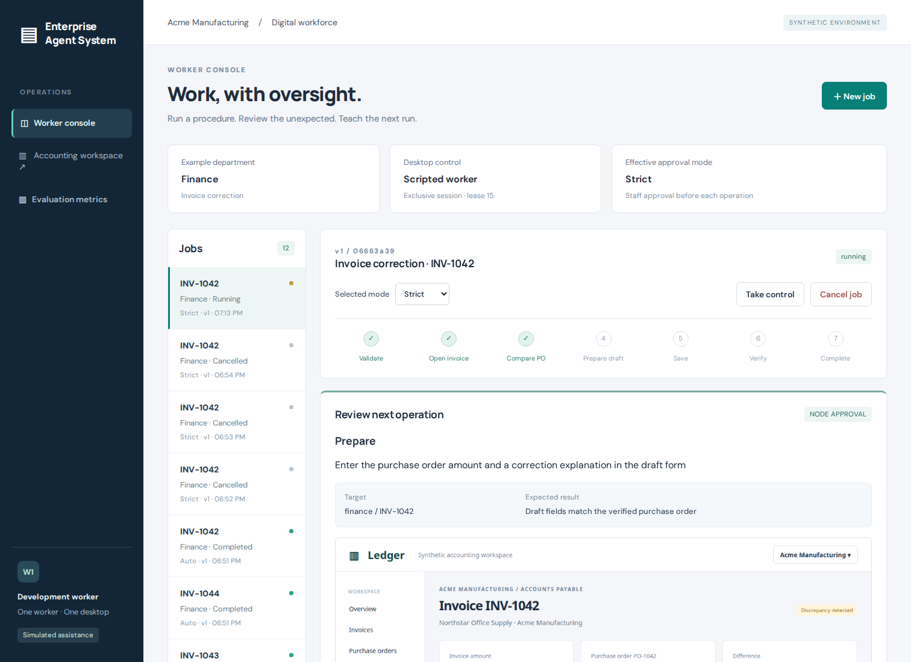
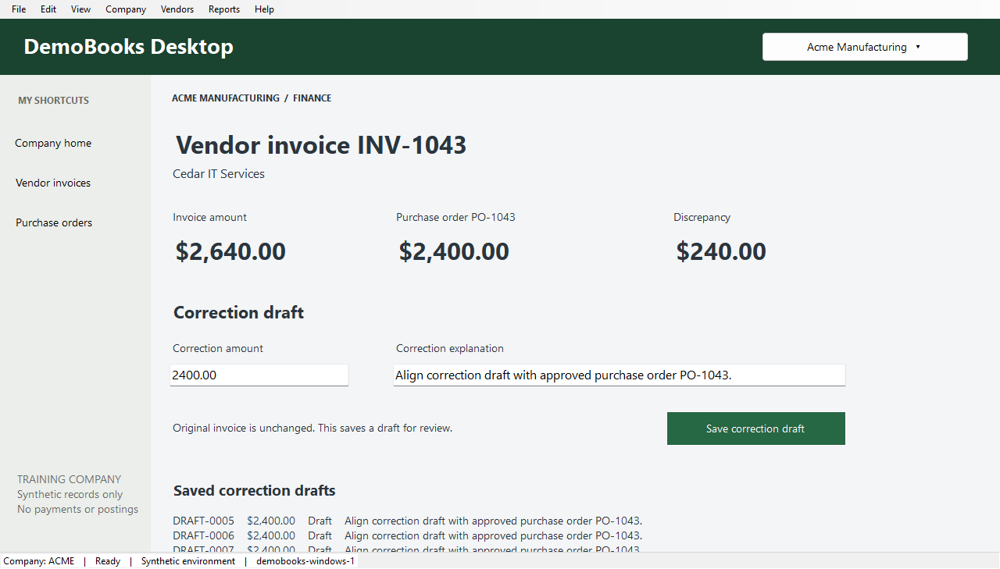
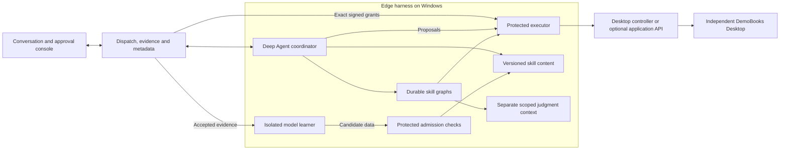

<div align="center">

# Enterprise Agent System

**A conversational digital worker that uses durable skills and learns from supervised work.**

Python · LangGraph · Deep Agents · OpenRouter · Windows UI Automation · FastAPI

[Quick start](#quick-start) · [Try the demonstration](#try-the-demonstration) · [How it works](#how-it-works) · [Teach a reusable improvement](#teach-a-reusable-improvement) · [Validation](#validation)

</div>

---

Enterprise Agent System is a department-agnostic platform for supervised digital workers. Departments supply role-specific skills, tools, permissions, and knowledge scopes; the platform provides job dispatch, approvals, evidence, recovery, and versioned learning.

**This is an experimental prototype.** I'm sharing it to get my ideas out there and explore how supervised digital workers could work. I know it isn't ready for me to dogfood in day-to-day work or for a business to adopt. The demonstrations, tests, and documented limitations reflect an idea in development, not a finished product.

I started this because I haven't found a good option for enterprise computer-use agents that brings together reliability, security, and a feedback cycle that learns from humans. I want to explore how tested procedures, supervised assistance, and human corrections could lead to reusable skills that remain supervised when they reach future runs. Those are the goals behind this prototype, not qualities I'm claiming it has already achieved.

The first runnable example is a Finance skill: a worker opens a synthetic invoice, compares it with a purchase order, identifies a discrepancy, and saves and verifies a correction draft. Staff can approve each operation, supervise unfamiliar situations, correct proposed actions, or take over the desktop.

Staff talk to a Deep Agent on the edge machine. It reads relevant skills and invokes their optional checkpointed LangGraph graphs, or composes approved operations when no procedure fits. **Strict is the only execution policy:** reading a skill, running its graph, and executing each operation require separate staff decisions.

Accepted, verified work enters a durable learning queue. A separate model context proposes guidance or a declarative skill graph; trusted runtime checks validate it before automatic activation. Skills can accumulate procedures, observed field handling, and corrected instructions. Repeated failures and later feedback also trigger reviews. Skills cannot add arbitrary Python, grant permissions, or remove approvals. Future requests pin an immutable version; staff can suspend or roll back versions.

Staff can teach through ordinary chat. After a request ends, a separate edge reviewer looks for corrections, preferences and reusable lessons, links them to the conversation evidence, and can update skill instructions after runtime validation. No assessment form is needed. Inferred feedback is labeled separately from verified outcomes, and chat cannot add executable graph steps. [Conversation learning and screenshots](docs/conversation-learning-and-screenshots.md) describes the boundaries.

The agent can capture the entire Windows desktop and send an annotated screenshot in chat. Each capture and share requires approval; attachments retain their capture time. The browser test fixture captures only its own viewport. The Ubuntu Marketing worker uses an application API and does not currently expose an interactive desktop screenshot tool.

This implements the direction in the [agent-led learning plan](docs/plans/agent-led-learning-plan.md), which supersedes the graph-first ordering, Auto mode, and mandatory learned-package PR review in the [original specification](docs/plans/original-prompt.txt). Earlier reviewed releases and PRs remain historical evidence; they are not silently activated by this change.

The accepted learning milestone is complete for this prototype: its baseline passed **214 regression tests**, and live Windows runs demonstrate teaching, revision, reuse after restart, prior-case checks and rollback for two workflow families, plus guidance-only learning. The [validation record](docs/cumulative-learning-validation.md) includes the failed attempts and the limits of these results. Staff decisions in the demonstrations were simulated.

**Desktop setup: the developer machine runs the backend and staff frontend; a separate Windows VM or PC runs LangGraph, the Deep Agent harness, desktop control, and DemoBooks.** The optional single-machine browser fixture uses a simulated model for regression tests. DemoBooks is a prototype application with synthetic records, not a QuickBooks integration.



Staff return to one ongoing conversation. The edge manages its working context using notes and searchable history; earlier details remain available after a context reset. Internal execution records still keep each request's approvals, cancellation and evidence separate. See [persistent sessions](docs/plans/persistent-session-context.md).

Chat does not require a record selector. Say, for example, “Compare invoice INV-1043 with its purchase order without saving.” The agent identifies the target from the conversation or asks for clarification, then proposes that record for staff approval. The current Finance example binds one invoice per work request; subsequent application operations still require their own approvals. Ordinary conversation has no default invoice.

The agent should choose capabilities that match the requested outcome; a related skill does not have to run. It can use approved operations and observations without a skill graph. The short-lived hand-coded invoice-price shortcut has been removed: application procedures belong in learned skills, while the harness enforces execution and approvals. Learning composes a bounded set of installed Finance operations and can derive guidance from accepted observed answers. It cannot generate arbitrary new capabilities; insufficient evidence can produce no change. A record missing from the visible invoice list produces a clear lookup result. The **Agent decisions & tool activity** panel exposes public explanations, actual calls, arguments, returned results, approvals, errors and observation evidence, with filters and expandable details. A skill name identifies a package; `run_skill` is the tool that executes its graph, whose internal operations appear separately in the log.

## Developer setup

The shared platform supports **Finance** on Windows and **Marketing** on Ubuntu. Marketing uses the independent synthetic Campaign Desk API. [Department integrations](docs/departments.md) explain input schemas, adapters, operation contracts and scoped skills. See the [Linux worker setup](docs/linux-worker.md).

The server plus separate Windows and Ubuntu workers has been exercised with concurrent live requests, scoped authorization and Marketing skill learning/reuse ([two-host evidence](docs/evidence/two-host-workers.json)). Follow the [two-machine developer setup](docs/developer-setup.md): start `enterprise-server` on the developer machine and install the isolated planner/executor/learner tasks on Windows. Addresses and credentials are configured locally. The backend does not connect directly to the desktop controller.

The native application can run with its API disabled. A separate controller reads accessibility controls and supplies accessibility actions or real clicks/typing. See [legacy desktop setup](docs/legacy-desktop.md) and the optional [application API adapter](docs/windows-accounting-machine.md).



## Quick start

This is the **optional browser test fixture**, useful without a Windows machine or model key. For the desktop prototype, use the [two-machine setup](docs/developer-setup.md).

Requires Python 3.11+ (tested on 3.12), Git, and a Chromium-compatible development machine. Linux is the tested platform.

```bash
git clone git@github.com:philip-roy-jones/enterprise-agent-system.git
cd enterprise-agent-system

python3 -m venv .venv
source .venv/bin/activate
pip install -r requirements-dev.txt
python -m playwright install chromium
cp .env.example .env

enterprise dev
```

On a minimal Linux machine, install browser system dependencies with `python -m playwright install --with-deps chromium`.

Open **[localhost:8000](http://127.0.0.1:8000)**. Staff sign in with email/password after an operator issues a one-time setup link; follow [fixture account setup](docs/developer-setup.md#optional-loopback-browser-fixture) in a second terminal before interactive use. The fixture API tokens are for explicitly labeled development automation, not the staff login form.

`enterprise dev` starts the backend and worker as separate processes. Ctrl+C stops both. To run them independently:

```bash
# Terminal 1
enterprise-server

# Terminal 2
enterprise-harness
```

The browser test workspace is at **[localhost:8000/mock](http://127.0.0.1:8000/mock)** in browser mode only. Windows deployments disable it. Use **Take control** before interacting with an active worker's desktop. Use **Release control** to resume automation.

Staff can also add scoped organizational guidance for the worker to search with individual approval. See [knowledge setup and access boundaries](docs/organizational-knowledge.md).

## Try the demonstration

Describe a request in **Talk to your worker**, including the record in ordinary language when needed. The agent proposes its target for approval or asks a clarification. A conversation can contain several requests; each has its own budget and desktop lease. Choose the department with **Workspace** and describe the work in chat. Synthetic fault scenarios are exercised through the development test drivers.

| Try this | What you should see |
| --- | --- |
| “Prepare a correction draft” | The agent requests the correction skill, invokes its workflow, and asks approval for each child operation |
| “Report the discrepancy without saving” | Supervised inspection and independently verified reporting; no draft is saved |
| “Report and classify the discrepancy without saving” | A separate judgment node uses only the disclosed comparison evidence |
| Changed amount field label | Approved observation and editing, followed by resuming the same skill run |
| Unfamiliar dialog | A separately approved recovery action |
| Interrupted Save confirmation | Reconciliation using the original operation identity; no blind second Save |
| Covered or minimized Windows app | Application activation before the next preview |
| Reject, cancel, or take control | Execution stops or pauses; existing authority cannot be reused |

Approve a meaningful registered operation, which may contain disclosed navigation clicks. A skill approval is never blanket approval of its children. Guidance in chat is not approval. Outcome acceptance is separate from approving actions.

For a repeatable browser walkthrough, run `enterprise demo --simulate-staff` while `enterprise dev` is running. This explicitly simulated staff driver submits decisions on synthetic jobs. Model provenance is recorded separately.

## How it works



The execution ledger, fresh observations, exclusive desktop lease, fencing epochs, deadlines, and uncertain-write reconciliation are shared by direct tools and skill graphs. Checkpoint replay resumes a stable invocation; it does not grant fresh authority or restore the external application. Rejection and permission denial cannot be routed around through another tool.

See [architecture](docs/architecture.md), [department boundaries](docs/departments.md), and [library API verification](docs/api-verification.md). One VM is enough for this synthetic development example. Staff identities and security boundaries do not imply one VM per employee.

The [security implementation](docs/security.md) adds individual identities, server-enforced resource permissions, exact signed execution grants, protected context and skill delivery, and separate planner/learner accounts on Windows and Ubuntu. The current regression suite passed **240 tests**, alongside actual Windows/Ubuntu access probes, live skill reuse and restart checks, and browser password setup/sign-in. Business operations remain Strict. The [security validation record](docs/security-validation.md) records actual account isolation, live learning and multi-host checks separately from simulated tests and remaining fleet limitations. Organizational SSO is intentionally outside the prototype; staff use email/password and workers retain separate service credentials.

## Teach a reusable improvement

1. Complete a request, supply corrections or guidance when needed, and verify the result.
2. Select **Accept completed work**. The server queues the evidence once.
3. When idle, the edge runs a bounded learner with scoped evidence and no inherited application/backend credentials. It proposes a skill or reports no justified change.
4. The runtime checks scope, evidence, operation order, compatibility, and prior behavior. Synthetic cases vary records and amounts and exercise refusal conditions. The learner cannot declare its own tests passed.
5. A passing immutable version activates automatically. **Accumulated skills & learning** shows the change, evidence, and status. A later request still requires every approval.
6. Use **Suspend** or **Activate this version** to stop future retrieval or roll back. Already running skill graphs retain their pinned version; cancel a running request if it must stop immediately.

Seeded source packages live in `src/edge-harness/skills/`. Installed versions live under the edge's `EAS_DATA_DIR/skills/`, with `manifest.json`, `SKILL.md`, hashes, and a local registry. Executable specifications reference trusted operations; Markdown cannot execute shell snippets or import Python. File or dependency changes invalidate the installed package until it is requalified.

The first slice supports Finance discrepancy reports, correction drafts, and guidance derived from accepted observed answers. Optional supporting text is retrieved only through a separately approved read. The learning view includes the instruction diff, operation changes, supporting evidence and runtime checks. Missing tools become development suggestions; they do not appear as invented capabilities.

Workflow admission runs synthetic behavioral checks. Guidance-only admission checks contracts and evidence and explicitly labels behavioral evaluation as not performed. Neither proves that model instructions are correct. Strict approval remains in force regardless of test outcomes. Model changes are recorded without automatically replaying all historical experiences. Arbitrary applications and new Python functions remain outside this learning surface.

The older `enterprise improve/review/deploy/rollback` commands and historical PRs preserve the original developer-reviewed resolver experiment. They do not activate packages in the new skill registry. Ordinary harness code changes remain development work.

## Configuration

Copy `.env.example` to `.env`. Runtime data and credentials are ignored by Git.

| Variable | Default | Purpose |
| --- | --- | --- |
| `EAS_DATA_DIR` | `runtime` | Durable backend data, checkpoints, screenshots, proposals |
| `EAS_BIND_HOST` / `EAS_BIND_PORT` | `127.0.0.1` / `8000` | Backend listener; configure locally |
| `EAS_BACKEND_URL` | `http://127.0.0.1:8000` | Worker-to-backend endpoint |
| `EAS_STAFF_TOKEN` | `local-staff-demo` | Explicit development API fixture only; not password sign-in |
| `EAS_WORKER_TOKEN` | `local-worker-demo` | Restricted worker API and browser session |
| `EAS_DEVELOPER_TOKEN` | `local-developer-demo` | Explicit development automation fixture only |
| `EAS_MODEL_MODE` | `simulated` | `simulated` or `live` |
| `EAS_MODEL_PROVIDER` / `EAS_MODEL_ID` | `openrouter` / `openai/gpt-5.6-luna` in the example | Provider and model for live assistance |
| `OPENROUTER_API_KEY` | unset | OpenRouter credential, kept in `.env` or the worker environment |
| `EAS_HEADLESS` | `true` | Set `false` to show the worker browser on a graphical desktop |
| `EAS_JOB_TIMEOUT_SECONDS` | `900` | Total job time budget, including staff waiting |
| `EAS_MAX_MODEL_CALLS` | `12` | Combined coordinator and judgment call budget per request; increase explicitly for longer teaching runs |
| `EAS_CONTEXT_MAX_CHARS` | `96000` | Active-history character budget; older context remains searchable on the edge |
| `EAS_LEARNING_ENABLED` | `true` | Enable bounded maintenance of accepted skill evidence on the edge |

Live mode uses LangChain's configurable `init_chat_model`, with the OpenRouter integration included for GPT 5.6 Luna. Follow the [API key setup](docs/credential-access.md), then enable live mode and restart. Adding a key alone leaves simulated mode enabled. Live recovery has been tested on the Windows VM, including screenshots and actual mouse/keyboard input with DemoBooks' API disabled. Those runs use explicitly simulated staff approvals; they are limited demonstrations, not a general model-reliability evaluation.

The loopback fixture uses labeled demo credentials. Remote setups require explicit individual identities, separate worker service credentials and HTTPS. Use the [isolated setup guide](docs/developer-setup.md); the [.env file alone is not a secret boundary](docs/credential-access.md).

## Validation

```bash
pytest -q                       # Includes real Chromium integration tests
pytest -q -m 'not browser'       # Authority, persistence, API and release checks
ruff check src tools tests
ruff format --check src tools tests
```

Browser tests start their own backend and worker using temporary databases and a separate port. They cover parent/child approval, rejected Auto requests, stale and duplicate decisions, permissions, navigation and UI variants, known/unfamiliar/unsaved dialogs, screenshot corrections, takeover, exclusive control, and worker restart after an ambiguous save. Skill tests cover immutable versions, tampering, scope, dependency changes, queue replay, automatic admission and rollback.

See the [original requirement audit](docs/original-prompt-audit.md) and [validation record](docs/validation.md) for actual native Windows runs, including covered-window recovery and staff takeover. GitHub Actions installs Chromium and runs lint, formatting, and the test suite. The metrics view separates simulated and live runs and reports completion, approval requests, corrections, fallback jobs, model calls/tokens, elapsed time, and recorded incorrect-action events. Zero recorded incorrect actions is not proof that every possible UI action is correct.

## Project map

```text
src/
├── edge-harness/                   Deep Agent, skill execution and integrations
│   ├── eas_harness/
│   │   ├── integrations/           Trusted reusable application operations
│   │   └── skill_runtime.py        Skill graph compiler and checkpoints
│   ├── skills/                     Bundled generic skill packages
│   ├── windows/                    Desktop controller and isolated task installer
│   └── linux/                      Isolated service installer and access probes
├── server/                         Independent backend and staff frontend
├── shared/                         Data contracts; no running service
└── test-software/
    ├── demobooks/                  Synthetic Windows accounting desktop
    ├── campaign-desk/              Synthetic Marketing metrics API
    └── ledger-fixture/             Optional browser accounting test fixture
tools/enterprise_dev/               Local demos and historical PR learning fixtures
tests/                             Cross-application regression tests
docs/                              Setup, architecture and validation records
docs/plans/                        Original specification and accepted plans
```

The server and edge harness are **independently installable applications** with separate dependencies, startup commands and configuration classes. The Windows harness installer separates its planner, executor and learner into differently privileged processes; they remain components of one edge application. Neither package depends on the other. The Deep Agent and skill graphs execute inside the harness. DemoBooks remains a separate .NET application. The shared package contains public contracts and validation definitions, with no credentials, environment loading, databases, desktop actions or graph factories.

From the repository root, install only the software a machine needs:

```bash
# Backend environment: no LangGraph, Deep Agent or desktop automation dependencies.
python -m pip install -c requirements.lock ./src/shared ./src/server
enterprise-server

# Package-only edge environment: no server or development tooling.
python -m pip install -c requirements.lock ./src/shared ./src/edge-harness
# For the Windows account boundary, use install-isolated-worker.ps1 in the setup guide.
```

Each application reads `.env` from its launch directory, or the file named by `EAS_ENV_FILE`. Keep the model and desktop-controller credentials on the edge machine. Development tooling is a separate root package; `pip install -r requirements-dev.txt` installs the full local test environment. Its `enterprise` CLI retains demo/improvement commands and compatibility aliases for `serve` and `worker`.

For an existing Windows checkout, stop the idle worker **before** upgrading and rerun `src/edge-harness/windows/install-worker.ps1`. The installer updates the launcher and installs only the contracts and harness. For a clean package boundary when migrating an old all-in-one installation, recreate its virtual environment after stopping it; reinstalling packages alone does not remove previously installed server dependencies. Preserve `.env` and `runtime/`, including checkpoint databases. The [developer setup](docs/developer-setup.md) has machine-specific steps.

## Implemented, simulated, and deferred

| Status | Scope |
| --- | --- |
| **Implemented** | Runnable console, backend, worker, mock app; real cyclic LangGraph and Deep Agents; real browser automation; durable approval/evidence storage; Strict-only enforcement; agent-led skill tools; correction/takeover; bounded recovery; save reconciliation; declarative skill learning, automatic admission, version pinning and rollback |
| **Simulated by default** | The model's decisions, all accounting records, and staff decisions only when the explicit demo/test driver is used |
| **Bounded prototype choices** | One synthetic company, Windows Finance and Ubuntu Marketing workers, bounded declarative learning, individual email/password accounts, SQLite persistence |
| **Deferred** | Real QuickBooks and generic third-party Windows automation; broad real-model quality evaluation; general autonomous code generation; arbitrary graph-code deployment and checkpoint migration; multiworker fleet orchestration |

The native adapter targets our own DemoBooks application. Generic Windows automation and real QuickBooks integration remain separate future adapters. No real accounting integration or production readiness is claimed.
