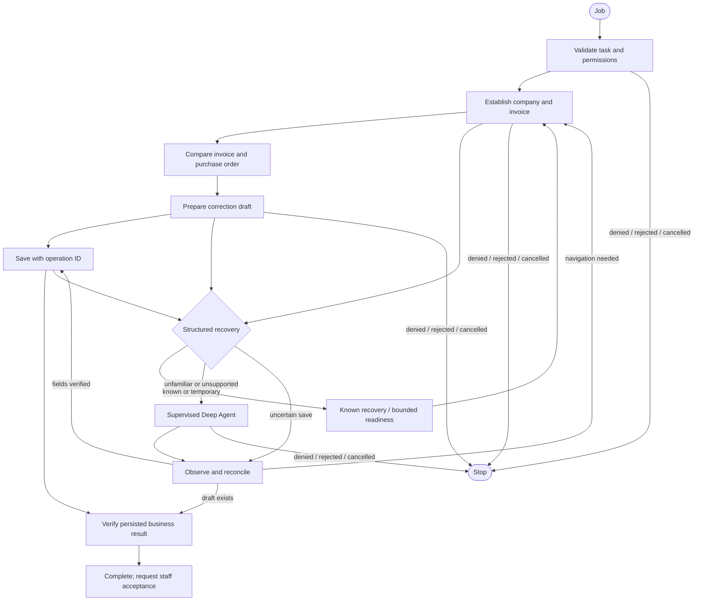

# Architecture and trust boundaries

## Processes

The FastAPI backend owns job dispatch, staff decisions, conversation events, role authentication, artifacts, the release registry, and persistent synthetic accounting records. SQLite uses WAL and transactional writes. The staff console uses server-sent events and periodic reconciliation so reconnecting retrieves the actual outstanding decision.

The Python worker polls a restricted HTTP RPC boundary, claims one session, runs the cyclic LangGraph, and initializes Deep Agents in the same process. A dedicated thread owns Chromium because Playwright's synchronous API is thread-affine. The browser reaches the mock application's authenticated HTTP interface through real buttons and form fields. Shared execution checks a fencing epoch before each desktop action.

The worker's two SQLite checkpoint files are on a durable volume, outside process memory. They are distinct from the accounting application state. Moving the worker to a different machine requires moving or mounting these files and using a reachable authenticated backend URL. Backend and worker credentials are separate.

## Role graph

Each named node has an execution contract. Strict approval applies to the outer node invocation, including non-desktop nodes such as validation and completion. START and END need no approvals. In Auto, role-level nodes execute automatically under the same permissions.

The outer graph checkpoints a paused continuation and ends its current scheduling tick while awaiting a decision. The worker starts the next tick from that durable continuation. It is a cyclic LangGraph, not a click-by-click script. Deep Agents uses its own durable LangGraph `interrupt()`/`Command(resume=...)` flow for tools. Its runnable context is isolated from the outer graph to prevent accidental checkpoint namespace inheritance.

## Approval binding

A proposal stores its operation name, original arguments, expected result, scope, screenshot, DOM target geometry, observation revision, and ownership epoch. The revision hashes application state and relevant target geometry. The shared layer re-observes before execution. The backend checks the action name, arguments, observation revision, invocation ID, epoch, job status, and approval status transactionally before consuming the decision.

The original proposal, staff decision, corrected arguments, executed action, and observed result are separate fields. Duplicate decisions conflict. Stale decisions are retained as evidence and replaced. A queued Strict decision remains required after selecting Auto. Fallback tool calls always require an individual decision, including `observe_app`.

Screenshots are captured automatically to prepare previews. That runtime evidence capture is distinct from an assistant-requested read tool, which is approved. A screenshot click is normalized from displayed size to the captured viewport and resolves to a scoped DOM control. The worker never executes arbitrary JavaScript, shell commands, filesystem operations, URLs, or unrestricted coordinate clicks from a model.

## Control and reconciliation

A transactional lease identifies the active job, controller, worker instance, epoch, expiry, and in-flight invocation. Another worker cannot claim an unexpired active session. Handoffs refuse an in-flight operation, invalidate pending decisions, increment the epoch, and require fresh observations. The UI's direct takeover changes the same persistent application state as the worker. Automation stays paused until staff releases it.

Lease expiry is 30 seconds; a restarted worker reacquires after expiry. Individual browser operations time out at six seconds, model requests at twenty seconds. Job elapsed time defaults to 900 seconds and includes staff waiting. Recovery attempts and model calls are independently bounded. A late or stale command fails its next fencing check.

The mock application supports an idempotency key equal to the job ID. A saved draft records its company, invoice, amount, note, and operation ID. If confirmation is interrupted, the graph marks the outcome uncertain and reconciles by inspecting persistent drafts. It does not automatically issue a second Save. A crash after saving uses the same business operation ID. The original invoice remains unchanged; no posting, payment, or submission operation exists.

A local log and an approval do not guarantee exactly-once effects in a real application. Native adapters must inspect external results and use application-supported idempotency when available.

## Improvement and releases

The manual improvement command accepts an exported, staff-accepted episode. It creates a separate Git worktree, changes the reusable amount-label library, commits selected synthetic evidence and regression tests, and runs the full suite in a separate synthetic environment. The bounded generator is deterministic. It does not pretend to be a general code-writing agent.

Subprocesses receive an allowlist of development environment variables. Runtime files, provider credentials, worker tokens, and live screenshots are not copied. A Git worktree on the same OS account is process/workspace isolation, not a hardened security sandbox; production development automation needs a separate identity/container and network restrictions.

The result includes a patch, candidate commit, check output, hashes, evidence reference, and review summary. Optional repository integration creates a draft PR. No command generating a proposal also approves or deploys it. A named developer decision and passing checks on the exact candidate are required for release.

The demonstrated deployment unit is the versioned resolver library, loaded from the checked candidate into the central release registry. Only idle workers receive it. New jobs copy and pin its version and labels; existing checkpoints retain their original graph topology. Rollback restores the previous registry. General Python graph-code deployment and topology migrations are deferred: retain old node definitions until their jobs finish, or implement an explicit migration rather than deleting them.

## Prototype access model

Three configurable bearer tokens distinguish staff, worker, and developer roles. Browser staff sessions use HttpOnly, SameSite=Strict cookies. Artifacts require staff authentication. The prototype binds to localhost and includes disclosed synthetic demo tokens. It has no SSO, tenant directory, TLS termination, tamper-proof audit log, or protection against a malicious administrator with filesystem access. Those are production requirements, not capabilities claimed by this prototype.
